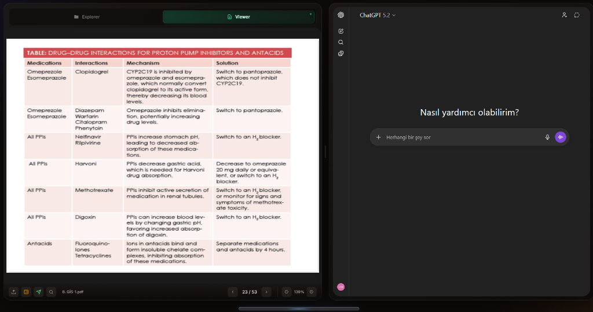
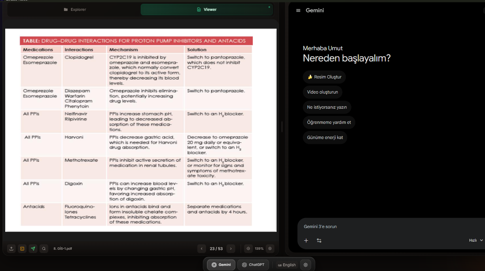

<p align="center">
  
</p>

<p align="center">
  
  
  
  
  
</p>

<h1 align="center">Quizlab Reader</h1>


<p align="center">
  <strong>A modern, split-screen Electron application that combines PDF reading with AI assistance</strong>
</p>

<p align="center">
  <a href="./README_TR.md">🇹🇷 Türkçe</a>
</p>

---

## 🎯 Overview

**Quizlab Reader** is a powerful desktop application designed for students and researchers who want to enhance their reading and study experience. It provides a seamless split-screen interface where you can view PDF documents on one side and interact with AI assistants (ChatGPT or Gemini) on the other.

### ✨ Key Features

| Feature | Description |
|---------|-------------|
| 📄 **PDF Viewer** | Full-featured PDF viewer with zoom, navigation, search, and text selection |
| 🤖 **AI Integration** | Built-in support for ChatGPT and Google Gemini |
| 👤 **Profile System** | Multiple account profiles with encrypted cookie storage |
| � **Session Sync** | **NEW!** Auto-sync keeps your sessions alive even after restarts |
| �🔐 **Secure Storage** | OS-level encryption (Windows DPAPI) for sensitive data |
| ✂️ **Text Selection** | Select text from PDF and send it directly to AI with one click |
| 📸 **Screenshot Tool** | Capture any area of the PDF and send it to AI for analysis |
| 🔄 **Auto-Send Mode** | Automatically send selected text to AI |
| 📐 **Resizable Panels** | Drag to resize panels according to your preference |
| 💾 **Persistent Settings** | Your preferences are saved between sessions |
| 🎨 **Modern UI** | Glassmorphism design with smooth animations |
| 🌐 **Multi-Language** | English and Turkish support |

---

## 🆕 What's New in v2.2.0

### 🔄 Persistent Session Synchronization
- **Auto-Sync Engine:** Automatically synchronizes session cookies to encrypted storage every 5 minutes.
- **Race Condition Protection:** Smart locking ensures no data loss during profile switching or rapid changes.
- **Secure Exit:** "Graceful Shutdown" mechanism waits for the final session backup before closing the app.
- **Fix:** Resolved the issue where Google sessions would expire or logout after restarting the application.

### Platform Detection System
- 🔍 Automatic platform detection from cookie domains (Gemini/ChatGPT)
- ⚠️ Platform mismatch warnings when importing wrong cookies
- 🔀 Mixed cookie detection and reporting
- 📋 Unknown domain notifications

### Notification System
- 🔔 Toast notifications for cookie reset errors
- ✅ Platform info shown on profile creation
- 🚫 Replaced browser alerts with modern toasts

### Bug Fixes
- Fixed missing `target` field in cookies-changed events
- Fixed misleading error messages in cookie reset flow
- Fixed default Gemini login state issue in AiWebview

---

## 🖼️ Screenshots

<details open>
<summary>Click to view screenshots</summary>

### Main Interface with ChatGPT
The application features a clean, modern split-screen interface with glassmorphism design elements.


### Main Interface with Gemini
Seamlessly switch between AI platforms with the bottom bar controls.


### Key UI Elements
- **File Explorer** - Premium glassmorphism header with drag-and-drop support
- **PDF Viewer** - Page navigation, zoom controls, search, text selection with floating "Send to AI" button
- **AI Panel** - Switch between ChatGPT and Gemini with auto-send toggle
- **Bottom Bar** - Quick access to AI platforms and settings
- **Settings Modal** - Profile management, cookie import, language selection

</details>

---

## 🚀 Getting Started

### Prerequisites

- **Node.js** 18.x or higher
- **npm** 9.x or higher
- **Git** (for cloning the repository)

### Installation

1. **Clone the repository**
   ```bash
   git clone https://github.com/ozymandias-get/Quizlab-Reader.git
   cd Quizlab-Reader
   ```

2. **Install dependencies**
   ```bash
   npm install
   ```

3. **Run in development mode**
   ```bash
   npm run dev
   ```

4. **Build for production** (optional)
   ```bash
   npm run build
   ```

### Download Pre-built Release

You can also download the latest installer from [Releases](https://github.com/ozymandias-get/Quizlab-Reader/releases).

---

## 📁 Project Structure

```
Quizlab-Reader/
├── src/
│   ├── main/                    # Electron main process
│   │   ├── index.js             # Main entry point
│   │   ├── windowManager.js     # Window lifecycle management
│   │   ├── profileManager.js    # Profile CRUD & cookie management
│   │   ├── cookieEncryption.js  # OS-level encryption (DPAPI)
│   │   ├── cookieImport.js      # Cookie validation & import
│   │   ├── googleAuth.js        # Google authentication popup
│   │   ├── pdfProtocol.js       # Custom PDF protocol handler
│   │   ├── browserConfig.js     # Browser/UA configuration
│   │   ├── ipcHandlers.js       # IPC message handlers
│   │   └── updater.js           # Auto-update functionality
│   │
│   ├── preload/                 # Preload scripts
│   │   └── index.js             # Secure IPC bridge
│   │
│   ├── renderer/                # React application
│   │   ├── index.html           # HTML entry point
│   │   └── src/
│   │       ├── App.jsx          # Main application component
│   │       ├── main.jsx         # React entry point
│   │       │
│   │       ├── components/      # React components
│   │       │   ├── AiWebview.jsx        # AI platform webview
│   │       │   ├── BottomBar.jsx        # Bottom control bar
│   │       │   ├── FloatingButton.jsx   # "Send to AI" floating button
│   │       │   ├── ScreenshotTool.jsx   # Screenshot capture tool
│   │       │   ├── SettingsModal.jsx    # Settings modal component
│   │       │   ├── CookieImportModal.jsx # Cookie import dialog
│   │       │   ├── PdfViewer.jsx        # PDF viewer barrel export
│   │       │   │
│   │       │   ├── pdf/                 # 📄 Modular PDF Viewer
│   │       │   │   ├── index.js               # Barrel export
│   │       │   │   ├── PdfViewer.jsx          # Main PDF component
│   │       │   │   ├── PdfToolbar.jsx         # Toolbar controls
│   │       │   │   ├── PdfSearchBar.jsx       # Search functionality
│   │       │   │   ├── PdfPlaceholder.jsx     # Empty state
│   │       │   │   └── hooks/                 # PDF-specific hooks
│   │       │   │       ├── index.js
│   │       │   │       ├── usePdfPlugins.js
│   │       │   │       ├── usePdfNavigation.js
│   │       │   │       ├── usePdfScreenshot.js
│   │       │   │       ├── usePdfTextSelection.js
│   │       │   │       └── usePdfContextMenu.js
│   │       │   │
│   │       │   ├── settings/            # ⚙️ Settings Components
│   │       │   │   ├── index.js               # Barrel export
│   │       │   │   ├── DataTab.jsx            # Cookie & profile management
│   │       │   │   ├── CookieSection.jsx      # Cookie reset controls
│   │       │   │   ├── ProfileSection.jsx     # Multi-account profiles
│   │       │   │   ├── LanguageTab.jsx        # Language selection
│   │       │   │   └── AboutTab.jsx           # App info & updates
│   │       │   │
│   │       │   └── FileExplorer/        # 📁 Modular File Explorer
│   │       │       ├── index.jsx              # Main component
│   │       │       ├── TreeItem.jsx           # Tree item with drag-drop
│   │       │       ├── FileExplorerHeader.jsx # Header component
│   │       │       ├── FileExplorerFooter.jsx # Footer component
│   │       │       ├── EmptyState.jsx         # Empty state view
│   │       │       ├── DropOverlay.jsx        # Drag-drop overlay
│   │       │       ├── NewFolderInput.jsx     # New folder input
│   │       │       ├── DeleteConfirmModal.jsx # Delete confirmation
│   │       │       ├── icons/                 # SVG icons
│   │       │       └── hooks/                 # Explorer hooks
│   │       │
│   │       ├── context/         # React context providers
│   │       │   ├── index.js             # Barrel export
│   │       │   ├── AppContext.jsx       # Global app state
│   │       │   ├── FileContext.jsx      # File system management
│   │       │   ├── ToastContext.jsx     # Toast notifications
│   │       │   └── LanguageContext.jsx  # i18n support
│   │       │
│   │       ├── hooks/           # Custom React hooks
│   │       │   ├── index.js             # Barrel export
│   │       │   ├── useSettings.js       # Settings modal logic
│   │       │   ├── useScreenshot.js     # Screenshot functionality
│   │       │   ├── useLocalStorage.js   # Persistence
│   │       │   └── usePanelResize.js    # Panel resizing
│   │       │
│   │       ├── constants/       # Configuration constants
│   │       │   ├── aiSites.js           # AI platforms config
│   │       │   ├── storageKeys.js       # LocalStorage keys
│   │       │   └── translations.js      # i18n translations
│   │       │
│   │       └── styles/          # CSS styles
│   │           ├── index.css            # Main CSS entry
│   │           └── modules/             # CSS modules
│   │
│   └── test/                    # Test files
│       └── ...                  # Unit tests
│
├── docs/                        # Documentation
│   └── screenshots/             # Application screenshots
│
├── resources/                   # Application resources
│   ├── icon.ico                 # Windows icon
│   └── icon.png                 # macOS/Linux icon
│
└── package.json                 # Project configuration
```

---

## 🛠️ Technology Stack

### Core Technologies

| Technology | Version | Purpose |
|------------|---------|---------|
| **Electron** | 28.0.0 | Desktop application framework |
| **React** | 18.2.0 | UI component library |
| **Vite** | 5.0.10 | Build tool and dev server |
| **PDF.js** | 3.11.174 | PDF rendering engine |

### Security Features

| Feature | Technology |
|---------|------------|
| **Cookie Encryption** | Windows DPAPI via Electron safeStorage |
| **Secure IPC** | Context isolation with preload bridge |
| **Session Isolation** | Per-profile partition system |
| **Domain Allowlist** | Strict navigation control |

---

## 📖 Usage Guide

### Profile Management

1. Open **Settings** (gear icon in bottom bar)
2. Go to **Data** tab
3. Click **Add Account** to create a new profile
4. Import cookies from your browser using EditThisCookie extension
5. The platform (Gemini/ChatGPT) is automatically detected from cookie domains

### Cookie Import (Recommended Method)

1. Install [EditThisCookie](https://chromewebstore.google.com/detail/editthiscookie-v3/ojfebgpkimhlhcblbalbfjblapadhbol) extension
2. Login to gemini.google.com or chatgpt.com in Chrome (use Incognito with single account)
3. Click EditThisCookie icon → Export → Copy JSON
4. In Quizlab Reader: Settings → Data → Add Account → Paste JSON

### Opening a PDF

1. Click **"Select PDF"** button or use the file explorer
2. Drag and drop PDF files directly into the application
3. PDFs are stored in your local library for quick access

### Sending Text to AI

1. **Select text** in the PDF viewer by clicking and dragging
2. A floating **"Send to AI"** button will appear
3. Click the button to send the selected text to the current AI

### Taking Screenshots

1. Click the **📸 camera icon** in the PDF toolbar
2. Draw a rectangle around the area you want to capture
3. The screenshot will be sent to the AI for analysis

### Switching AI Platforms

1. Hover over the bottom bar to reveal the control panel
2. Click on **ChatGPT** or **Gemini** to switch platforms
3. Each platform maintains its own session and chat history

---

## ⌨️ Keyboard Shortcuts

| Shortcut | Action |
|----------|--------|
| `Ctrl + O` | Open PDF file |
| `Ctrl + F` | Search in PDF |
| `Ctrl + +` | Zoom in |
| `Ctrl + -` | Zoom out |
| `Ctrl + 0` | Reset zoom |
| `Escape` | Cancel screenshot mode |

---

## 🔧 Configuration

### Supported AI Platforms

Currently supported AI platforms (configured in `src/renderer/src/constants/aiSites.js`):

| Platform | URL | Cookie Domains |
|----------|-----|----------------|
| ChatGPT | https://chatgpt.com | chatgpt.com, openai.com |
| Gemini | https://gemini.google.com | google.com, gemini.google.com |

---

## 🤝 Contributing

Contributions are welcome! Please feel free to submit a Pull Request.

1. Fork the repository
2. Create your feature branch (`git checkout -b feature/AmazingFeature`)
3. Commit your changes (`git commit -m 'Add some AmazingFeature'`)
4. Push to the branch (`git push origin feature/AmazingFeature`)
5. Open a Pull Request

---

## 📝 License

This project is licensed under the MIT License - see the [LICENSE](LICENSE) file for details.

---

## 🙏 Acknowledgments

- [PDF.js](https://mozilla.github.io/pdf.js/) - PDF rendering by Mozilla
- [Electron](https://www.electronjs.org/) - Cross-platform desktop apps
- [React](https://reactjs.org/) - UI component library
- [Vite](https://vitejs.dev/) - Next-generation build tool

---

## 📧 Contact

**Project Link:** [https://github.com/ozymandias-get/Quizlab-Reader](https://github.com/ozymandias-get/Quizlab-Reader)

---

<p align="center">
  Made with ❤️ for students and researchers
</p>
